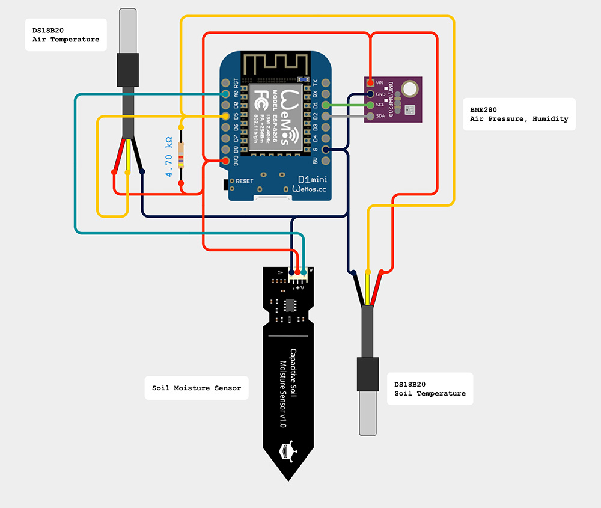
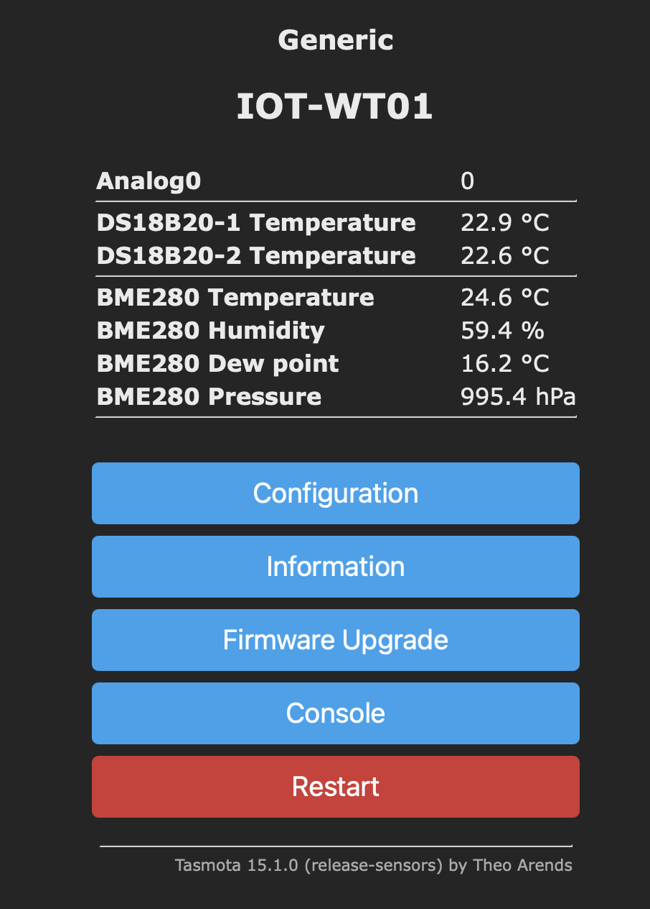

# nodered-weather-station

### Wemos D1 - Tasmota - MQTT - Node-Red

### Wemos d1 (pro) PINs:

- GPIO04 - D2 SDA - BME280
- GPIO05 - D1 SCL - BME280
- GPIO14 - D5     -	DS18B20 x2 (air temperature, soil temperature)
- GPIO17 - ADC0   -	Capacitive Soil Moisture Sensor

  

### Tasmota WebUI:

  

